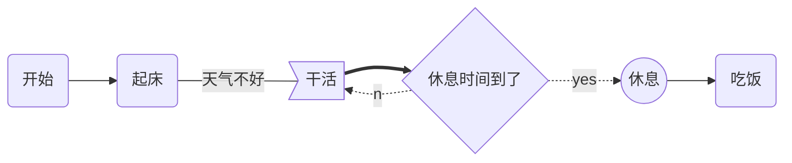

2265-Day2.md

=======
### MD花式技巧

#### 流程图 flow

$$
\alpha+\hat a\cdot \hat b
$$


```flow
start=>start: 接收到消息
info=>operation: 读取信息
setCache=>operation: 更新缓存
end=>end: 处理结束

start->info->setCache->end
```


```flow
start=>start: API请求
cache=>operation: 读取Redis缓存
cached=>condition: 是否有缓存？
sendMq=>operation: 发送MQ，后台服务更新缓存
info=>operation: 读取信息
setCache=>operation: 保存缓存
end=>end: 返回信息

start->cache->cached
cached(yes)->sendMq
cached(no)->info
info->setCache
setCache->end
sendMq->end

```

#### mermaid




#### 时序图 sequence

```sequence
Title:时序图示例
客户端->服务端: 我想找你拿下数据 SYN
服务端-->客户端: 我收到你的请求啦 ACK+SYN
客户端->>服务端: 我收到你的确认啦，我们开始通信吧 ACK
Note right of 服务端: 我是一个服务端
Note left of 客户端: 我是一个客户端
Note over 服务端,客户端: TCP 三次握手
participant 观察者
```

1.First item
2.second item
	1.First
	2.Second

<font size=5>定义:</font>	$ r_p = \beta_P \cdot r_B + \alpha_P + \epsilon_P $

$β_p$ ：投资组合相对于市场组合的beta系数
